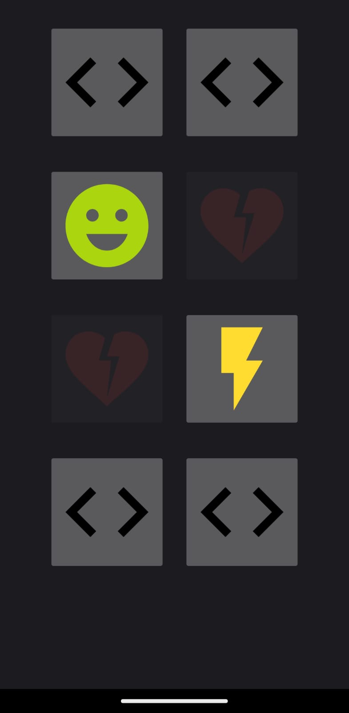

# Memory_Game
This app implements a simple version of the Memory Game. The objective is to flip cards over to find pairs. If the cards flipped over match (have the same image), those cards remain flipped up for the remainder of the game. The objective is to flip over all cards in as few moves as possible.

App screenshot:

